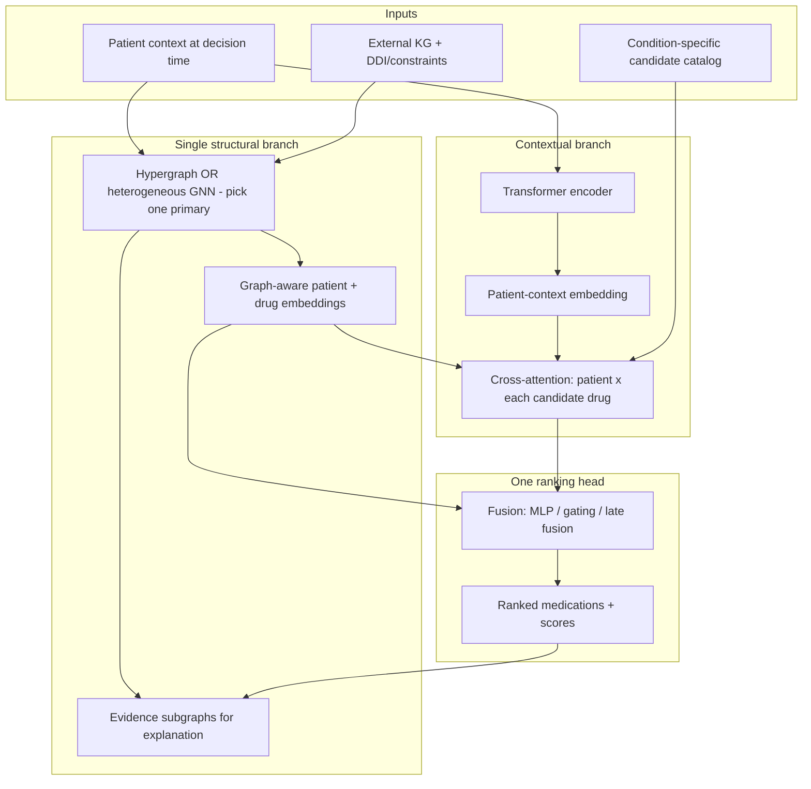

## Executive take

Your instinct to combine **relational structure** (graph) with **contextual matching** (Transformer) is sound and aligned with your own `ResearchDetail.md` and `ARCHITECTURE.md`. The risk is not “hybrid = bad”; the risk is **three modules all doing candidate discovery and ranking on overlapping signals** without clear division of labor.

As you described it:

1. General GNN → proposes candidates from relationships  
2. Transformer → scores each candidate against full patient context  
3. Hypergraph GNN → also ranks candidates from relationships  

that layout is **likely redundant** unless each block has a **non-overlapping job**. Right now, (1) and (3) compete directly, and (2) may re-learn what the graph modules already encode.

---

## What each component is good at (in your setting)

Your task (from `ARCHITECTURE.md` and `worknotes.txt`) is **ranking condition-appropriate medication candidates** for a patient/stay, with patient-level splits and temporal cutoffs—not open-ended drug generation.

| Component | Natural strength | Best role in your system |
|-----------|------------------|--------------------------|
| **Candidate catalog** (deterministic) | Safe, reproducible, no leakage | Define the candidate set from **training-only** condition–medication co-occurrence (your planned table rows) |
| **Transformer** | Long-range interactions, temporal EHR, notes, cross-attention patient↔drug | **Patient-context encoder** + **per-candidate scoring** via cross-attention |
| **GNN / HGNN** | Explicit medical relations, multi-hop paths, DDI/contraindication structure, similar patients | **Relational encoder** over patient-specific subgraph + external KG |
| **Hypergraph** | Higher-order co-occurrence (e.g., diagnosis set + lab pattern → drug class) | **One structural representation choice**, not a second ranker on top of a plain GNN |

From your literature notes: **HypeMed** and **KEHGCN** use hypergraphs as the *primary* structural encoder, not as a third ranking head beside a separate GNN ranker. **KGDNet** and **KindMed** use a clearer pipeline: graph encoding → temporal/attention → single recommendation head.

---

## Where redundancy appears in your proposal

### 1. GNN “lists candidates” + HGNN “ranks by relationships”

Both operate on **relationship structure**. If both:

- use similar nodes (diagnoses, drugs, labs, patients), and  
- both output medication scores,

you are effectively running **two relational rankers**. Unless they use **different graphs or different supervision**, gains are usually marginal while complexity, leakage risk, and explanation ambiguity grow.

**Redundancy signal:** If ablation shows removing HGNN barely changes metrics when GNN stays, or vice versa, they were duplicating work.

### 2. Transformer “maps all context per medication” + graph rankers

Redundancy is **partial**, not total:

- **Non-redundant** when Transformer models **within-patient dynamics** (lab trajectories, visit order, note semantics) and graph models **between-entity medical knowledge** (disease–drug, drug–drug, ontology).
- **Redundant** when the Transformer input already includes the same KG paths, neighbor drugs, and co-prescribing patterns the GNN/HGNN aggregate—then all three learn similar compatibility functions.

Your cross-attention idea (patient representation aligned to each candidate drug) is the right Transformer role—it matches the “Cross-Attention Transformer” row in `ResearchDetail.md` and is **not** redundant *if* graph modules supply **drug/relational embeddings**, not duplicate full rankings.

### 3. Candidate generation vs ranking blurred

`ARCHITECTURE.md` treats candidates as a **catalog learned from training data**, with ranking as the model job. Using GNN to “list” candidates mixes:

- **Retrieval** (which drugs enter the slate), and  
- **Ranking** (order within the slate).

That is valid in recommender systems (retrieve → rerank), but then roles must be explicit:

```text
Catalog (training-only) → optional graph retrieval (prune) → joint scoring head
```

Not: GNN proposes → Transformer ranks → HGNN ranks again with no fusion rule.

---

## Is it the “best” approach?

**Hybrid Transformer + graph structure: yes, as a research direction.**  
**Hybrid Transformer + GNN + separate HGNN, each ranking independently: probably not optimal** without strong ablation justification.

A cleaner pattern that preserves your ideas and reduces redundancy:



### Recommended division of labor

1. **Candidates (non-learned or lightly learned)**  
   Condition-specific catalog from training data; optional **graph retrieval** only to **prune** (e.g., drop drugs with hard contraindication edges—not to replace the catalog).

2. **One graph module (choose primary)**  
   - **Hypergraph** if you want higher-order visit/diagnosis/lab bundles (HypeMed/KEHGCN line).  
   - **Heterogeneous R-GCN** if you want typed edges and explicit paths for explainability (GAMENet/EGNet line).  
   Use the other only in an **ablation**, not both as co-rankers in v1.

3. **Transformer**  
   Encode temporal + heterogeneous patient events and notes; **cross-attend** to each candidate’s graph embedding (and optionally molecular features later, SafeDrug-style). Output **compatibility scores**, not a second independent candidate list.

4. **Single fusion ranker**  
   One head: `score(patient, drug) = f(h_transformer, h_graph, h_drug)`. This matches your documented “fusion ranker” in `ARCHITECTURE.md` and avoids three competing orderings.

5. **Explanation reuse**  
   Graph branch exports **paths/hyperedges**; Transformer exports **attention weights**; rules handle hard blocks. That supports your grounded explainability layer without a third ranking pathway.

---

## When a three-stage design *is* justified

A retrieve → rerank stack can work if stages are **functionally different**:

| Stage | Module | Different job |
|-------|--------|----------------|
| Retrieve | Fast graph or frequency | Cut 500 candidates → 50 under latency/safety constraints |
| Rerank | Transformer + graph fusion | Fine-grained patient-specific ordering |
| Safety filter | Rules + DDI graph | Hard veto, not soft ranking |

Here HGNN would **not** also rank everything the reranker already ranked; it would either **build the retrieve graph** or **supply DDI subgraph features** to the reranker.

---

## Red flags for your project specifically

Given your constraints (patient-level splits, temporal cutoffs, explainability, clinician review):

1. **Leakage:** If GNN/HGNN edges include future prescriptions, outcomes, or test-set patient similarity, both graph modules amplify the same leakage.
2. **Explanation confusion:** Three rankers make it hard to say *why* drug A beat drug B—which head decided?
3. **Evaluation:** You need ablations: Transformer-only, graph-only, hypergraph-only, fusion; plus **retrieve-only vs full-rank** if you keep GNN candidate generation.
4. **Cold start:** Graph structure helps when history is thin; Transformer+KG is the right combo (your worknotes on LEADER/MGRN). Redundant rankers do not add extra cold-start benefit.
5. **Baselines first:** `ARCHITECTURE.md` requires beating linear/XGBoost rankers before claiming hybrid superiority—a simpler fused model is easier to defend than a triple-stack.

---

## Comparison to your similar-paper notes

| Paper pattern | Lesson for your design |
|---------------|------------------------|
| **MGRN** | Multi-view (visit / sequence / token), then **fuse**—not three separate final rankers |
| **GAMENet / SafeDrug** | One GNN over EHR+KG (+ optional DDI memory); ranking is end-to-end |
| **HypeMed / KEHGCN** | Hypergraph **replaces** flat graph modeling for higher-order relations |
| **CausalMed** | Graph encodes **causal** visit structure—graph role is representation, not duplicate ranking |
| **KGDNet / KindMed** | GNN → temporal/attention → **one** prescribing head |
| **EGNet** | Attention (patient) + GCN (KG) → **single** prediction |

None of these typically use **GNN candidate list + Transformer list + HGNN rank** as three parallel outputs.

---

## Practical recommendation

**Keep:** Hybrid recommendation; Transformer for context and cross-attention per candidate; graph structure for relations and explainability; hypergraph **if** you need higher-order clinical bundles.

**Reconsider:**  
- GNN as independent **candidate proposer** (use catalog + optional graph pruning instead).  
- HGNN as a **second relationship ranker** alongside a general GNN (merge into one structural branch).  
- Transformer producing a **separate list** rather than scores fused with graph embeddings.

**Strongest v1 architecture for your thesis narrative:**

> Deterministic training-only candidates → **hypergraph or heterogeneous GNN** for patient–KG embeddings and evidence → **Transformer cross-attention** for contextual matching → **single fusion ranker** → explanation from graph paths + attention + rules.

That stays faithful to `ResearchDetail.md` (“Transformer = context, GNN = relations, fused ranking”) without stacking redundant relationship rankers.

---

## Ablation plan (to prove it empirically)

When you implement, these experiments answer “redundant or not?” directly:

1. Catalog + XGBoost (required baseline)  
2. Transformer-only cross-attention ranker  
3. GNN-only or HGNN-only (pick one structural model)  
4. Transformer + graph embeddings, **late fusion** (recommended)  
5. Full triple-stack (your original idea)  

Compare NDCG@K, MRR, calibration, and **explanation fidelity** (do cited graph paths match the graph branch actually used?). If (5) ≈ (4) but (4) ≫ (2) and (3), redundancy was real and the simpler hybrid wins.

---

**Bottom line:** Hybrid Transformer + graph is a strong fit for your explainable conversational recommender. The specific layout **GNN lists → Transformer lists → HGNN ranks** is **more redundant than necessary** because two graph modules and possibly the Transformer all encode compatibility from overlapping relational evidence. Reframe to **one structural encoder + one contextual encoder + one ranker**, and use the graph for both **scoring and grounded evidence**—that aligns better with your architecture docs and the medication-rec literature you’ve already surveyed.

If you want to go deeper next, we can sketch two concrete variants (hypergraph-primary vs R-GCN-primary) with tensor shapes and what each exports to your explanation module—still in design-only form.

Your confusion is reasonable. The phrase **“candidate catalog”** sounds like a trivial preprocessing step, while **“HGNN proposes candidates, Transformer ranks”** sounds like the real model. The fix is to separate two different jobs:

1. **Search space** — which medications are even considered  
2. **Ranking model** — which of those medications fit *this* patient  

The catalog answers (1). Your HGNN→Transformer idea is a **learned** version of (1)+(2). Both can coexist in research; they are not mutually exclusive.

---

## What the candidate catalog actually is

In your project it is **not a neural model**. It is a **training-data artifact** built in `build_training_table.py` (planned in `InitialPlan.md`):

- For each **condition** (e.g. sepsis, diabetes), take the **top-N most-prescribed medications** seen in the **training split only**.
- For each **patient + condition**, form rows: `(patient, condition, medication)` for every medication in that condition’s list.
- **Label:** `label_prescribed = 1` if that patient actually got the drug; `0` if the drug is in the catalog but was not prescribed.

So:

| Question | Answer |
|----------|--------|
| Is it trained? | **No** — it is **counted/fitted on training data** (like a vocabulary or IDF table). |
| Is it deterministic? | **Yes** — same training split + same N → same catalog. |
| Is it the recommender? | **No** — it only defines **who competes** in the ranking task. |

Your `worknotes.txt` and `PosterPresentationGuide.md` define the task as: **rank plausible condition-specific candidates**, not predict any drug from the full formulary.

---

## How the catalog can be “wrong”

Deterministic does not mean correct. It can be wrong in several important ways:

### 1. Coverage error (too narrow)
If N=20 for sepsis but the true drug is the 25th-most common in training, that drug **never appears** in train/val/test rows. The ranker **cannot** recommend it, and metrics **cannot** credit it. Retrieval recall is capped before the model runs.

### 2. Weak negative labels
`AGENT-MEMORY.md` states clearly: **unobserved candidates are not guaranteed clinical negatives**. A drug in the catalog with label `0` may mean:
- clinician chose a different equally valid option,
- formulary/site preference,
- contraindication,
- or simply not documented.

So the catalog defines a **learning-to-rank proxy task**, not ground-truth “wrong drugs.”

### 3. Condition mapping error
If ICD→condition grouping is coarse or wrong, the catalog mixes drugs that are not truly comparable for that decision point.

### 4. Leakage
If the catalog is built using **all data** (including test patients), you leak population statistics. It must be fit on **training only** (`CODE_REVIEW.md`, `CODING-STANDARDS.md`).

### 5. Observed ≠ optimal
Prescribed drugs are **historical behavior labels**, not proof of best treatment. The catalog inherits that limitation no matter who generates candidates.

So the catalog is not “truth”; it is an **evaluation contract**: “Given these plausible options, how well does the model recover what was prescribed?”

---

## Why research still uses it if it feels “easy”

Because in medication-recommendation papers, the **research contribution is usually not catalog construction**. It is:

- patient representation,
- relational reasoning,
- ranking quality,
- safety (DDI, contraindications),
- generalization,
- explainability.

A fixed or statistical candidate set is standard because it:

1. **Fixes the task** — comparable NDCG@K, MRR@K across baselines and ablations.  
2. **Keeps compute bounded** — scoring 20–200 drugs per patient vs tens of thousands.  
3. **Matches clinical framing** — decision support among **condition-appropriate options**, not random formulary search.  
4. **Separates baselines from hybrid model** — XGBoost and Transformer+GNN rank the **same** slate.

**GAMENet**, **SafeDrug**, **HypeMed**, etc. also restrict the output space (training drug set, multi-label over known medications). They do not recommend from the entire RxNorm universe at inference. The catalog is your explicit version of that restriction.

Think of it like information retrieval research:

- **Catalog** ≈ document collection definition  
- **HGNN + Transformer** ≈ retrieve + rerank  

Nobody dismisses TREC because the document set is predefined.

---

## Your proposal: HGNN lists candidates → Transformer ranks

That is a legitimate and common design: **retrieve-then-rerank**.

```text
Patient + KG/EHR graph
        │
        ▼
   HGNN retrieval  ──►  candidate set C (e.g. top-50 drugs)
        │
        ▼
   Transformer cross-attention  ──►  final ranked list
```

This is **more aligned** with your intuition than “catalog only,” and it can be a **real research contribution** if HGNN retrieval is learnable and evaluated.

### What HGNN does that a frequency catalog does not

| Aspect | Top-N frequency catalog | HGNN retrieval |
|--------|-------------------------|----------------|
| Uses patient structure | No (condition-level only) | Yes (diagnoses, labs, co-meds, paths) |
| Uses external KG | No | Yes |
| Personalization at retrieval | No | Yes |
| Higher-order relations | No | Yes (hyperedges) |
| Learned | No | Yes |

So your proposal is **not** “easy vs hard”; it moves **personalized retrieval** into the graph module. That is defensible and closer to **HypeMed / KEHGCN / GraphCare** than to a plain frequency table.

### The main risk: cascade error

If HGNN retrieval drops the true medication, **the Transformer never sees it**. Frequency catalogs have the same problem if N is too small, but a **condition-wide** catalog is often **wider recall** than a **patient-specific** retrieve-top-K step.

Mitigations used in practice:

- Retrieve **top-K per patient** with K large enough (50–100), not 5.  
- **Union**: `candidates = HGNN_topK ∪ condition_catalog` (safest hybrid).  
- Report **retrieval recall@K** separately from **ranking NDCG@K**.  
- Ablate: catalog-only vs HGNN-only vs union vs full pipeline.

---

## Recommended framing for your thesis

Do **not** frame it as “catalog **or** HGNN.” Frame it as **two-stage hybrid ranking**:

### Stage A — Candidate generation (retrieval)
**Goal:** produce a patient-specific shortlist under safety constraints.

Options (ablation ladder):

1. **Baseline:** top-N per condition from training (frequency catalog)  
2. **Graph retrieval:** HGNN scores all condition-eligible drugs, keep top-K  
3. **Hybrid retrieval:** union of (1) and (2), minus rule-blocked drugs  

Research claim: *personalized graph retrieval improves recall of prescribed medications vs condition-frequency retrieval.*

### Stage B — Contextual ranking (reranking)
**Goal:** order the shortlist using full patient context.

- Transformer encodes temporal EHR, labs, notes, constraints.  
- Cross-attention between patient state and each candidate drug embedding (from HGNN + drug features).  
- Single scoring head outputs final rank.

Research claim: *contextual reranking improves NDCG/MRR over retrieval-only scores.*

That gives you a clear story:

> Frequency catalog = reproducible baseline and safety floor  
> HGNN = learnable, relational, personalized retrieval  
> Transformer = contextual reranking  
> Explanation = HGNN paths + attention + rules  

---

## What is “trained” in each design?

| Component | Trained? | What it learns |
|-----------|----------|----------------|
| Condition catalog (top-N) | No | Nothing — statistics from train split |
| HGNN retrieval | **Yes** | Embeddings and propagation over patient–KG hypergraph |
| Transformer ranker | **Yes** | Context interactions and patient–drug compatibility |
| Labels (`label_prescribed`) | N/A | Supervision from historical prescriptions |

Your proposed architecture **is** the trainable system. The catalog is **experimental infrastructure**, like a held-out drug vocabulary.

---

## Is “deterministic catalog” weak for publication?

Only if you present it as the **whole recommender**. In the paper:

**Weak framing:**  
“We use top-N drugs per condition, then rank.” → sounds like feature engineering.

**Strong framing:**  
“We formulate medication recommendation as **personalized retrieve-then-rerank**: a hypergraph neural network retrieves relation-supported candidates from patient-specific clinical hypergraphs and external medical knowledge; a Transformer reranks them using longitudinal context and cross-attention. A condition-frequency catalog serves as a **coverage baseline and ablation**, not as the primary retrieval mechanism.”

That matches your research narrative and similar-work positioning (HypeMed, KEHGCN, KGDNet).

---

## Practical recommendation

1. **Keep a training-only condition catalog** — not as the final story, but as:
   - baseline retrieval,
   - coverage floor (union with HGNN),
   - fair comparison for XGBoost baseline.

2. **Make HGNN the primary retriever** in the hybrid module — scores drugs via relational evidence; outputs top-K + subgraph evidence for explanation.

3. **Make Transformer the reranker** — does not “list” drugs independently; scores each retrieved candidate.

4. **Evaluate both stages:**
   - Retrieval: recall@K, hit@K (did we include prescribed drugs?)  
   - Ranking: NDCG@K, MRR@K (did we put them at the top?)

5. **Ablation table** (essential for reviewers):

   | Setup | Retrieval | Rerank |
   |-------|-----------|--------|
   | Baseline | Catalog | XGBoost |
   | A | Catalog | Transformer |
   | B | HGNN | HGNN score only |
   | C | HGNN | Transformer (**your proposal**) |
   | D | Catalog ∪ HGNN | Transformer |

If C beats B, Transformer adds value. If C beats catalog-only, HGNN retrieval adds value. If D ≈ C, catalog is mostly redundant except as safety net.

---

## Direct answers

**“How is the catalog trained?”**  
It is not trained end-to-end. It is **built** from training-split prescription counts per condition (top-N). Fit on train only; frozen for val/test.

**“How could it be wrong?”**  
Too-small N, bad condition mapping, weak negatives, leakage, and prescribing ≠ optimality.

**“Why use it if it’s easy?”**  
Because it defines a **standard, bounded ranking benchmark**—not because it is the research innovation.

**“Is HGNN retrieve + Transformer rank better?”**  
**Yes, as the main hybrid design**, provided you (a) measure retrieval recall, (b) avoid tiny K, and (c) keep catalog as baseline/union—not as a competing third ranker.

---

**Bottom line:** The catalog is not the recommender; it is the **slate definition** for training and evaluation. Your HGNN→Transformer pipeline is the actual research model—a **graph-based retriever plus context-based reranker**. Keep the catalog as a controlled baseline and coverage safety net, and center the contribution on **learned relational retrieval + contextual ranking + grounded explanation**.

If useful next, I can outline a concrete inference flow (inputs, K, union rule, what each stage exports to your explanation module) without writing code.