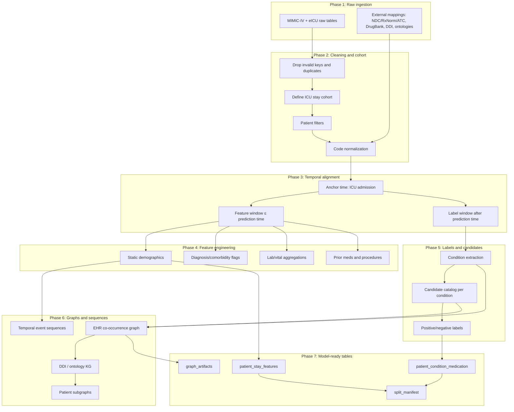
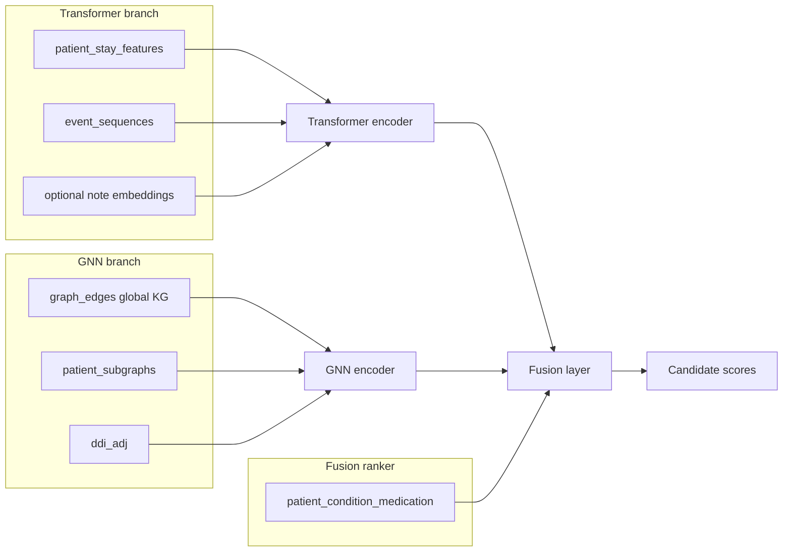

# SOTA Preprocessing for Medical Recommendation + Pipeline for Your Hybrid Module

## 1. What SOTA papers actually do (two preprocessing families)

Most medication-recommendation papers on MIMIC fall into **two families**. Your project needs elements from **both**, plus a third layer for **candidate ranking**.

### Family A — Visit-level combination prediction (dominant benchmark)

Used by: **GAMENet, SafeDrug, COGNet, MICRON, MGRN, HiRef, CausalMed, HI-DR, DrugRec**

| Step | Standard practice |
|---|---|
| Raw tables | `DIAGNOSES_ICD`, `PROCEDURES_ICD`, `PRESCRIPTIONS` |
| Drug normalization | `NDC → RxCUI → ATC-3` |
| Diagnosis/procedure | ICD-9 codes; MIMIC-IV often **ICD-9 only** (HiRef) |
| Cohort | Patients with **≥ 2 visits/admissions** |
| Label window | Medications in **first 24 hours** of admission (GAMENet) |
| Vocabulary pruning | Top ~300 meds, ~2000 diagnoses, ~1000 procedures |
| Visit object | One admission = `{diag set, proc set, med set}` as multi-hot vectors |
| Output | `records_final.pkl`, `voc_final.pkl`, `ddi_A_final.pkl`, `ehr_adj_final.pkl` |
| Task | Predict **full medication combination** for current visit |
| Metrics | Jaccard, F1, PRAUC, DDI rate |

### Family B — Knowledge-graph + temporal hybrid models

Used by: **KindMed, KGDNet, KEHGCN, HypeMed, GraphCare, EGNet**

| Step | Standard practice |
|---|---|
| Base EHR | Same visit-level records as Family A |
| External knowledge | ICD/ATC ontologies, SemMedDB/UMLS semantics, DrugBank DDI |
| Per-visit graphs | Admission-wise clinical KG + medicine KG |
| Temporal modeling | Separate clinical stream + medication stream (KindMed); or visit/sequence/token views (MGRN) |
| Safety | DDI adjacency matrix + DDI loss term |
| Optional extras | Hypergraphs (KEHGCN, HypeMed), curated DDI sources |

### Family C — Your project's direction (from `README.md` + `worknotes.txt`)

| Aspect | Your approach |
|---|---|
| Task | **Candidate ranking**: `patient/stay + condition + medication → label_prescribed` |
| Features | Richer than Family A: labs, vitals, severity, allergies, temporal history |
| Models | **Transformer** (context/sequence) + **GNN** (relations) + fusion ranker |
| Explainability | LIME + GNNExplainer + KG paths + rules (separate from recommendation) |
| Evaluation | Ranking metrics (precision@k, NDCG, MRR) + external validation on eICU |

**Key insight:** Do not copy SafeDrug verbatim. Use its **drug normalization and graph construction** as a submodule, but build a **richer, temporally bounded, condition-specific ranking pipeline** on top.

---

## 2. Canonical SOTA preprocessing pipeline (step by step)

This is what ~80% of papers share, with your extensions marked.



---

## 3. Detailed preprocessing stages

### Stage 1 — Data cleaning

**What SOTA does (SafeDrug `processing.py`):**

| Operation | Detail |
|---|---|
| Drop invalid meds | Remove `NDC = 0`, nulls, duplicates |
| Sort temporally | By `SUBJECT_ID`, `HADM_ID`, `STARTDATE` |
| Diagnosis cleaning | Drop nulls, duplicates; keep `ICD9_CODE` or harmonized ICD |
| Procedure cleaning | Drop `ROW_ID`, deduplicate, sort by `SEQ_NUM` |
| Inner join | Keep only admissions with diagnosis + procedure + prescription |

**What you should add:**

| Operation | Why |
|---|---|
| Referential integrity | Every `stay_id` must resolve to `subject_id` + `hadm_id` |
| Plausibility checks | Age, LOS, lab values within clinical bounds |
| Semi-structured dose fields | Treat MIMIC `dose_val_rx` and eICU `dosage` as text, not floats |
| Cancelled orders | eICU `drugordercancelled = Yes` → exclude from labels |
| Source tag | `source ∈ {mimic, eicu}` on every row |

---

### Stage 2 — Patient / stay filtering

**SOTA conventions:**

| Filter | Papers | Rationale |
|---|---|---|
| Multi-visit patients only | GAMENet, SafeDrug, HiRef, MGRN | Longitudinal history for personalization |
| First 24h medications as label | GAMENet, KindMed | Early critical prescribing window |
| Top-K frequent codes | SafeDrug: 300 meds, 2000 dx | Reduce sparsity |
| ICD-9 only on MIMIC-IV | HiRef, KindMed | Avoid ICD-9/10 mapping ambiguity |

**Recommended filters for your hybrid module:**

| Filter | Recommendation |
|---|---|
| **Unit** | ICU stay (`stay_id` / `patientunitstayid`) |
| **Adults** | MIMIC: `anchor_age >= 18`; eICU: document `>89` handling |
| **Minimum data** | Stay must have ≥1 condition + ≥1 candidate-eligible med event |
| **Multi-visit** | Keep all stays for ranking; use multi-visit subset as ablation (MGRN/KindMed need history) |
| **Single-visit** | Do not drop entirely — your worknotes note cold-start; report separately |
| **Code pruning** | Top-N meds **per condition** (your approach), not global top-300 only |

---

### Stage 3 — Missing-value handling

**SOTA practice:**

| Data type | Typical handling |
|---|---|
| Sparse eMAR / infusion detail | Drop or use event-type-specific columns only |
| Missing NDC mapping | Drop prescription row (SafeDrug) |
| Missing labs/vitals | Forward-fill within stay (time-series pipelines); or leave missing + mask |
| Missing modalities | KindMed/MGRN handle missing procedure or diagnosis per visit separately |

**Recommended for your Transformer branch:**

| Strategy | Use when |
|---|---|
| **Missing indicator flags** | Every important lab/vital (`creatinine_missing=1`) |
| **Stay-level imputation** | Median within same stay for labs (training stats only) |
| **No imputation for labels** | Labels come from observed orders only |
| **MNAR awareness** | Labs ordered because clinician suspected problem — document bias |
| **Exclude outcome features by default** | Your worknotes warn outcome columns can leak future information |

---

### Stage 4 — Feature engineering

SOTA papers are **thin** here (mostly ICD + procedure + ATC codes). Your hybrid module needs **much richer features**, which is a deliberate differentiator.

#### 4A. Static / demographic features (Transformer input)

| Feature group | Examples | Used in |
|---|---|---|
| Demographics | age, sex, ethnicity/race | KindMed patient node, GraphDiffMed |
| Admission context | admission type, ICU unit, hospital region (eICU) | Context embedding |
| Severity | APACHE (eICU), admission location, mortality flags | Risk context |

#### 4B. Diagnosis / condition features

| Feature | Construction |
|---|---|
| Primary condition | Index condition for ranking group (e.g. sepsis) |
| Comorbidity flags | Binary flags for top comorbid ICD categories |
| Comorbidity count | Number of active diagnoses at prediction time |
| Diagnosis embeddings | ICD code indices or ontology embeddings (HiRef hyperbolic) |

**Temporal rule:** Use only diagnoses known **at or before prediction time**. MIMIC billing diagnoses may be recorded at discharge — do not use as early features without a time-valid source.

#### 4C. Procedure / prior intervention features

| Feature | Source |
|---|---|
| Procedure flags | ICD procedure codes before prediction time |
| Treatment flags (eICU) | `treatmentstring` paths (ventilation, dialysis, lines) |
| Prior medication count | Distinct meds before prediction time |
| Prior medication classes | ATC-class presence in history |

#### 4D. Laboratory results (critical for Transformer — most SOTA papers skip this)

Per stay, per concept, compute **before prediction time**:

| Aggregation | Examples |
|---|---|
| last | last creatinine, last lactate |
| min / max | min MAP, max HR |
| mean | mean WBC over window |
| trend / slope | creatinine slope over 24h |
| abnormality flags | lactate > 2, creatinine above threshold |
| missingness rate | fraction of expected labs not measured |

Shared concepts to harmonize across MIMIC + eICU: creatinine, lactate, WBC, platelets, sodium, potassium, glucose, HR, MAP, SpO2, temperature.

#### 4E. Constraint / safety features (GNN + rule layer)

| Feature | Source |
|---|---|
| Allergy flags | eICU `allergy` (explicit); MIMIC partial |
| Renal impairment flag | Derived from creatinine/eGFR |
| Current medication classes | Prior meds that constrain new choices |
| DDI pair risk | From DDI graph for candidate vs current meds |

---

### Stage 5 — Temporal sequence construction

**SOTA patterns from your related-work notes:**

| Paper | Temporal design |
|---|---|
| **GAMENet / RETAIN** | Visit sequence; RNN over past visits |
| **KindMed** | Separate GRU for clinical stream + medication stream |
| **MGRN** | Visit-level, sequence-level, token-level views |
| **KGDNet** | RNN temporal + Transformer attention over admissions |
| **HypeMed** | Visit as hyperedge; retrieve similar past visits |
| **EHRS/GT-BEHRT** | Visits as "words", patient history as "sentence"; graph per visit |

**Recommended temporal contract for your project:**

```
t0 = ICU admission time
t_pred = t0 + 24 hours        # prediction/decision time
t_label_end = t_pred + 24h    # label window

Features:  all events with time ≤ t_pred
Labels:    medication orders with t_pred < start_time ≤ t_label_end
History:   all prior stays for same patient (if any), with same cutoff logic
```

**Build three parallel temporal artifacts:**

| Artifact | Contents | Feeds |
|---|---|---|
| `event_sequences` | Time-ordered events: dx, lab, vital, proc, med | Sequential Transformer |
| `visit_sequences` | One vector per past stay | KindMed-style dual RNN / MGRN visit view |
| `static_snapshot` | Aggregated pre-t_pred features | Feature Interaction Transformer |

---

### Stage 6 — Medication label generation

**SOTA (Family A):**  
For visit `t`, label = multi-hot vector of all ATC-3 drugs prescribed in first 24h.

**Your project (Family C — from `worknotes.txt` + `README.md`):**

```
For each (patient_uid, stay_uid, condition_c):
  positives = {medications actually prescribed for condition c at this stay}
  candidates = top-N meds observed for condition c in TRAINING data
  negatives  = candidates \ positives
  
  For each candidate medication m:
    row = (patient, stay, condition, m, label=1 if m in positives else 0, features...)
```

| Design choice | Recommendation |
|---|---|
| Condition definition | Harmonized condition token (ICD roll-up / sepsis cohort) |
| Candidate catalog | Built from **training set only** (avoid popularity leakage) |
| Negatives | Plausible-but-not-prescribed (not random global drugs) |
| Label type | Binary per candidate; rank within `(stay, condition)` group |
| Primary label source | Order initiation (`prescriptions` / eICU `medication`), not eMAR administration |
| Outcome columns | Risk context only; exclude from default feature set (per worknotes) |

---

### Stage 7 — Knowledge-graph preparation

**SOTA builds multiple graphs. Your GNN branch needs all of these:**

#### Graph 1 — EHR co-occurrence graph (`ehr_adj`)

From SafeDrug/GAMENet:
- Nodes: medications (ATC-3 indices)
- Edge: two drugs co-prescribed in same visit
- Used by: GAMENet memory bank, HiRef co-occurrence encoder

#### Graph 2 — DDI graph (`ddi_adj`)

From DrugBank / TWOSIDES:
- Nodes: medications
- Edge: known drug-drug interaction
- Top-40 severe side effects (GAMENet/SafeDrug convention)
- Used by: SafeDrug, KEHGCN, EGNet for safety

#### Graph 3 — Ontology / medical KG

From KindMed / HiRef / KEHGCN:
- Nodes: diagnoses, procedures, medications (+ optional lab concepts)
- Edge types:
  - `parent_child` (ICD/ATC hierarchy)
  - `diagnosis_medication` (co-occurrence or curated)
  - `diagnosis_diagnosis` (comorbidity / SemMedDB semantics)
  - `contraindication` (negative edges — KEHGCN)
- HiRef: hyperbolic ontology embedding + sparsity-refined co-occurrence

#### Graph 4 — Patient-specific subgraph (per stay)

From GraphCare / KindMed:
- Nodes: patient, active diagnoses, active labs (abnormal), candidate meds, prior meds
- Edges: patient–diagnosis, diagnosis–medication, patient–medication, medication–medication (DDI)
- Used by: heterogeneous GNN, GNNExplainer for explanations

**Training-safety rule:** Graph statistics (co-occurrence counts, candidate catalogs, vocabularies) must be fit on **training patients only**.

---

### Stage 8 — Train / validation / test splitting

**SOTA consensus (SimilarResearchPaperFindings.pdf, p.3):**

| Rule | Practice |
|---|---|
| Split unit | **Patient-level** (never row-level or visit-level) |
| Ratios | 80/10/10 or 80/20 train/test (HiRef: 2+ visits; others 8:1:1) |
| Temporal leakage | Features only from before prescription time |
| Visit leakage | For visit `t`, history = visits `< t` only |
| External test | eICU entirely held out (your README strategy) |

**Recommended split manifest:**

```text
split_manifest.json
  - patient_uid → {train|val|test|external}
  - split_seed
  - cohort_version
  - prediction_time_contract
  - excluded_leakage_features
```

**Default leakage exclusions (from worknotes + README):**
- `medication_*` history features that include future meds
- `outcome_*` features (unless temporally bounded)
- `candidate_*` popularity from full dataset
- discharge-time diagnoses used as early predictors

---

## 4. Recommended preprocessing pipeline for YOUR hybrid module

This is the pipeline I would implement, combining SOTA conventions with your architecture.

### Phase A — Foundation (borrow from SafeDrug)

1. Extract `diagnoses_icd`, `procedures_icd`, `prescriptions` (+ `icustays`, `patients`, `admissions`)
2. Normalize medications: `NDC → RxCUI → ingredient/ATC-3`
3. Build `voc_final` vocabularies on **training patients only**
4. Build `ddi_adj` and `ehr_adj` from external + training co-occurrence

### Phase B — Rich clinical features (your Transformer differentiator)

5. Extract `labevents`, `chartevents` (MIMIC) / `lab`, `vitalPeriodic` (eICU)
6. Harmonize to shared lab/vital concepts with unit conversion
7. Aggregate per stay with temporal cutoff
8. Extract allergies (eICU), severity (APACHE), demographics

### Phase C — Temporal sequences (KindMed + MGRN + KGDNet)

9. Build time-ordered event sequences per stay (pre-prediction only)
10. Build prior-stay history sequences for returning patients
11. Create three views: **visit snapshot**, **event sequence**, **token-level code pairs**

### Phase D — Ranking table (your core task)

12. Define index conditions per stay
13. Build condition-specific candidate catalog from training positives
14. Generate `patient_condition_medication` rows with binary labels
15. Attach pre-decision feature vector to each row

### Phase E — Graph artifacts (your GNN differentiator)

16. Build global heterogeneous KG (ontology + co-occurrence + DDI)
17. Materialize per-stay patient subgraphs for GNN batching
18. Store edge provenance for explanation module

### Phase F — Splits and QC

19. Patient-level split on MIMIC; eICU as external
20. Run leakage tests: no patient overlap, no future features, no full-corpus candidates
21. Export manifests and data dictionary

---

## 5. Final model-ready tables and schema

Your hybrid system needs **six core tables/artifacts**, not one monolithic CSV.

### Table 1 — `cohort_stays` (cohort manifest)

| Column | Type | Description |
|---|---|---|
| `stay_uid` | string | Unified stay ID |
| `patient_uid` | string | Unified patient ID |
| `source` | enum | `mimic` / `eicu` |
| `source_stay_id` | string | Original stay key |
| `admit_time` | timestamp/offset | ICU admission anchor |
| `prediction_time` | timestamp/offset | Decision time |
| `age`, `sex` | numeric/cat | Demographics |
| `los_hours` | float | Length of stay |
| `split` | enum | train/val/test/external |
| `index_condition` | string | Primary condition (optional) |

### Table 2 — `patient_stay_features` (Transformer input)

One row per stay. Wide feature table.

| Column group | Examples |
|---|---|
| IDs | `stay_uid`, `patient_uid`, `source`, `split` |
| Demographics | `age`, `sex`, `ethnicity`, `admission_type` |
| Severity | `apache_score`, `icu_unit_type` |
| Diagnosis flags | `dx_sepsis`, `dx_diabetes`, `dx_ckd`, `n_diagnoses` |
| Lab aggregates | `creatinine_last`, `lactate_max`, `wbc_mean`, `lab_creatinine_missing` |
| Vital aggregates | `map_min`, `hr_mean`, `spo2_last` |
| Prior history | `n_prior_stays`, `n_prior_meds`, `prior_med_class_*` |
| Constraints | `has_allergy`, `allergy_class_*`, `renal_impairment_flag` |
| Provenance | `feature_window_start`, `feature_window_end`, `feature_manifest_version` |

### Table 3 — `patient_condition_medication` (ranking target table — primary training artifact)

From `worknotes.txt` + `README.md`:

| Column | Type | Description |
|---|---|---|
| `row_id` | string | Unique row |
| `stay_uid` | string | FK to cohort |
| `patient_uid` | string | For split integrity |
| `condition` | string | Normalized condition token |
| `medication` | string | Candidate ingredient / ATC-3 |
| `medication_id` | int | Vocabulary index |
| `label_prescribed` | int | 1 = prescribed, 0 = candidate negative |
| `split` | enum | train/val/test/external |
| `candidate_rank_group` | string | `stay_uid + condition` for ranking metrics |
| `prescription_time` | timestamp | When positive label occurred (positives only) |
| `source` | enum | mimic/eicu |

**Optional feature columns on same row (for tabular baselines):**  
Join selected fields from `patient_stay_features` or keep features separate and join at model load time (cleaner).

### Table 4 — `event_sequences` (Sequential Transformer input)

| Column | Type | Description |
|---|---|---|
| `stay_uid` | string | FK |
| `event_order` | int | Sequence position |
| `event_time` | float | Hours from ICU admission |
| `event_type` | enum | lab/vital/dx/proc/med |
| `event_code` | string | Concept or code |
| `event_value` | float/text | Numeric value or presence flag |
| `event_token_id` | int | Vocabulary index for embedding |

### Table 5 — `graph_edges` (GNN global graph)

| Column | Type | Description |
|---|---|---|
| `src_id` | string | Source node |
| `dst_id` | string | Destination node |
| `src_type` | enum | patient/diagnosis/medication/lab/procedure |
| `dst_type` | enum | node type |
| `relation` | enum | co_occur, treats, contraindicates, parent_of, ddi, similar |
| `weight` | float | Edge strength / probability |
| `source_origin` | enum | ehr/ontology/ddi/curated |
| `split_policy` | enum | train_only / static_external |

### Table 6 — `patient_subgraphs` (per-stay GNN batch)

| Column | Type | Description |
|---|---|---|
| `stay_uid` | string | FK |
| `node_ids` | list | Nodes in subgraph |
| `node_types` | list | Types per node |
| `edge_index` | list | COO format edges |
| `edge_types` | list | Relation per edge |
| `candidate_med_nodes` | list | Medication nodes to score |

### Supporting artifacts (not training tables, but required)

| Artifact | Purpose |
|---|---|
| `voc_diagnosis.json` | Code → index |
| `voc_medication.json` | Ingredient/ATC → index |
| `voc_lab.json` | Lab concept → index |
| `ddi_adj.npz` | DDI adjacency matrix |
| `ehr_adj.npz` | Co-prescription matrix |
| `candidate_catalog.json` | Top-N meds per condition (train-derived) |
| `split_manifest.json` | Patient → split assignment |
| `preprocessing_report.json` | Counts, attrition, coverage, unmapped rates |

---

## 6. How each table feeds Transformer vs GNN vs fusion



| Component | Primary inputs | What it learns |
|---|---|---|
| **Transformer encoder** | `patient_stay_features`, `event_sequences`, optional notes | Context interactions among labs, vitals, dx, history, constraints |
| **Sequential Transformer** | `event_sequences` | Temporal patterns (KindMed/MGRN/KGDNet) |
| **Heterogeneous GNN** | `graph_edges`, `patient_subgraphs` | Diagnosis–medication–lab relations, DDI structure |
| **Cross-attention fusion** | Patient embedding × candidate medication embedding | Align context with each candidate |
| **Ranking head** | Fused embedding per row in `patient_condition_medication` | Score for binary/ranking loss |
| **Explainability** | LIME on `patient_stay_features`; GNNExplainer on `patient_subgraphs`; paths from `graph_edges` | Grounded evidence (your ResearchDetail separation) |

---

## 7. What to borrow vs what to extend from SOTA

| SOTA convention | Borrow? | Extend for your project? |
|---|---|---|
| NDC → ATC-3 normalization | Yes | Also map to RxNorm ingredient for cross-source harmonization |
| Multi-visit filter | Optional | Keep single-visit for cold-start analysis |
| First 24h label window | Yes | Align with prediction_time contract |
| `records_final.pkl` visit structure | Partially | Also build richer stay features + event sequences |
| `ddi_adj` + `ehr_adj` | Yes | Add ontology edges and contraindication edges |
| Multi-label full-set prediction | No | Use condition-specific candidate ranking |
| Labs/vitals | Rare in SOTA | **Add** — key Transformer advantage |
| Patient-level split | Yes | Add eICU external split |
| Temporal cutoff | Mentioned but often weak | **Enforce strictly** — your credibility differentiator |
| Explanation separation | PIE-Med only | **Core contribution** — LIME + GNNExplainer + rules, not LLM invention |

---

## 8. Evaluation-oriented outputs (what to report after preprocessing)

| Report item | Why |
|---|---|
| Cohort attrition funnel | Shows filtering transparency |
| Vocabulary sizes (dx, med, lab) | Compare to HiRef/SafeDrug scales |
| Candidate coverage per condition | Validates ranking feasibility |
| % meds mapped to RxNorm/ATC | Harmonization quality |
| Cross-source concept overlap (MIMIC vs eICU) | Gates pooled training |
| Label prevalence per condition | Class imbalance plan |
| DDI rate in labels vs predictions | Safety metric (GAMENet tradition) |
| Leakage audit results | Patient split + temporal cutoff tests |

---

## 9. Minimal viable preprocessing order (practical build sequence)

If you want the shortest path to a working hybrid prototype:

1. **SafeDrug-style base** → meds, dx, proc normalized per stay  
2. **Temporal contract** → lock `t_pred`, feature window, label window  
3. **`patient_condition_medication`** → ranking table with negatives  
4. **Lab/vital aggregates** → add to `patient_stay_features`  
5. **`ehr_adj` + `ddi_adj`** → global graphs  
6. **Per-stay subgraphs** → GNN batches  
7. **Patient-level split** → MIMIC train/val/test  
8. **XGBoost baseline** on `patient_condition_medication` (validate pipeline)  
9. **Transformer** on features + sequences  
10. **GNN** on subgraphs → late fusion  

This mirrors your README status (data foundation → baselines → hybrid) while aligning with what KindMed, MGRN, KGDNet, and HiRef do well.

---

## 10. One-paragraph recommendation

State-of-the-art medication recommendation papers preprocess MIMIC through a shared SafeDrug/GAMENet pipeline: clean prescriptions and diagnoses, map drugs to ATC-3, filter to multi-visit patients, prune to frequent codes, align admissions, and export visit-level multi-hot sequences plus DDI and co-prescription graphs. Your hybrid Transformer+GNN module should **inherit that normalization and graph layer**, but **not** its task formulation. Build a temporally bounded, ICU-stay-level, condition-specific candidate-ranking pipeline with rich lab/vital features and event sequences for the Transformer, heterogeneous patient subgraphs and ontology/DDI edges for the GNN, and a fused ranking head over `patient_condition_medication` rows. Split by patient, enforce pre-prescription feature cutoffs, fit vocabularies and graphs on training data only, and hold eICU out for external validation. That design matches your research goal — accurate, faithful, grounded, clinician-reviewable recommendations — better than copying the standard multi-label visit pipeline alone.

---

Step	What they do	Why
1. Medication cleaning	Drop invalid NDC (NDC=0), deduplicate, sort by STARTDATE	Remove noise from prescription table
2. Drug normalization	NDC → RxCUI → ATC-4 → ATC-3 using mapping files (ndc2RXCUI.txt, RXCUI2atc4.csv, drug-atc.csv)	Standardize free-text drug names to a shared vocabulary
3. Cohort filter	Keep only patients with ≥ 2 visits/admissions	Enables longitudinal models using visit history
4. Vocabulary pruning	Top 300 medications (ATC-3), top 2000 diagnoses (ICD-9), sometimes top 1000 procedures	Reduce sparsity; make training feasible
5. Admission alignment	Inner join on SUBJECT_ID + HADM_ID across diagnosis, procedure, prescription	Only visits with all three modalities
6. Visit construction	One row per admission; each visit = unique sets of {ICD codes, procedure codes, ATC-3 drugs}	Creates visit-level multi-hot representation
7. Patient sequences	Sort admissions chronologically per patient → records_final.pkl	Longitudinal visit sequence for RNN/GNN models
8. Vocabulary files	voc_final.pkl maps diagnosis/procedure/medication strings → integer indices	Model input encoding
9. Graph construction	ehr_adj_final.pkl: drugs co-prescribed in same visit; ddi_A_final.pkl: drug-drug interactions from DrugBank/TWOSIDES	GNN / safety-aware models
10. Train/val/test split	Usually patient-level split (not row-level)	Prevent leakage

## Extraction and Harmonization Components

- `mimic_extract.py`
- `eicu_extract.py`
- `harmonize.py`: unified schema + shared vocab
- Unified stay-level tables (source-tagged)
- `build_training_table.py`: candidates + labels + split
- Transformer + GNN + Fusion

## MIMIC Sources

- `icu/icustays, hosp/patients + admissions, diagnoses_icd + d_icd_diagnoses, labevents + d_labitems, prescriptions / pharmacy / emar`

## eICU Sources

- `patient, diagnosis, lab, medication / infusionDrug, allergy`

## Harmonization mapping (high level)

### IDs

MIMIC `subject_id`/`hadm_id`/`stay_id` and eICU `uniquepid`/`patientunitstayid` map to unified `patient_uid` + `stay_uid` + `source`.

### Conditions

MIMIC ICD-9/10 vs eICU diagnosis strings/ICD - normalize to a shared condition vocabulary (ICD-10 roll-up or condition tokens), reusing snake_case normalization from the deprecated pipeline.

### Medications

MIMIC drug names vs eICU drug names - normalize to ingredient-level tokens (and ideally RxNorm/ATC-style grouping) so candidate catalogs align across sources.

### Labs/vitals

Map to a shared concept set (e.g., creatinine, lactate, WBC, HR, MAP) with unit harmonization.

Schema differences and any unmapped concepts are logged; cross-dataset coverage is reported so we know which shared features are usable for pooled training vs validation.